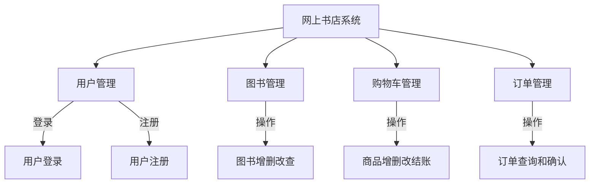

# 网上书店管理系统

## 物联网Web应用程序开发
  
## 实验的目的及要求

通过本次实验，学生需把本课程所学到的各方面技术综合应用于一个相对全面的小型动态网站，加深对web应用开发的总体理解和各种技术结合使用的体会，为后续的课程设计和毕业设计等实践环节积累经验，打好基础。

## 背景

当今网络高速发展，网络购物已经不再新奇，它满足人们对各种物品的需求。"书籍是人类进步的阶梯"，对于网上书店来说，无疑是网络购物中心最好的学习例子，作为电商项目它可能比较简单，但麻雀虽小五脏俱全。我们小组决定设计一个拥有用户购物模块和管理员模块的网上书店。

## 需求分析

### 3.1 问题陈述

网上书店系统应该具有这样的功能：

- **用户功能**：
  - 浏览所出售书籍，可按价格或书名查询
  - 将商品添加至购物车并购买
  - 对订单进行签收操作
- **管理员功能**：
  - 对图书进行增删改的处理
  - 对用户订单进行发货等操作

### 3.2 功能需求分析

- **安全性管理**：
  - 管理员通过账号和密码登录，管理书籍和订单信息，拥有最大权限。
  - 普通用户有一定的操作权限，但仅限于用户模块。
  - 服务器端的权限设置和数据库登录权限设置保证系统安全。

- **角色权限**：
  - **管理员**：管理图书、订单、用户等。
  - **用户**：管理购物车、订单，进行登录注册。

## 系统功能模块

### 4.1 功能结构



### 4.2 模块简介

#### **前台模块**
- 查看、检索图书
- 购物车管理
- 用户订单管理
- 用户注册、登录管理

#### **后台模块**
- 图书管理（增删改查）
- 订单管理
- 管理员权限管理

## 详细设计

### 5.1 数据库设计

#### 建库语句

```sql
drop database if exists book;
create database book;
use book;
```

#### **用户表**
```sql
create table t_user(
   id int primary key auto_increment,
   username varchar(50) not null unique,
   password varchar(32) not null,
   email varchar(50) 
);
```

#### **图书表**
```sql
create table t_book(
    id int primary key auto_increment,
    name varchar(100),
    price decimal(11,2),
    author varchar(100),
    sales int,
    stock int,
    img_path varchar(200)
);
```

#### **订单表**
```sql
create table t_order(
   order_id varchar(50) primary key,
   create_time datetime not null,
   total_money decimal(11,2) not null,
   status int not null default 0,
   user_id int not null,
   foreign key (user_id) references t_user(id)
);
```

## 代码实现

### 5.2 用户模块

#### **数据库连接（JDBCUtils）**
```java
static {
    try {
        Properties properties = new Properties();
        InputStream inputStream = JdbcUtils.class.getClassLoader().getResourceAsStream("jdbc.properties");
        properties.load(inputStream);
        dataSource = (DruidDataSource) DruidDataSourceFactory.createDataSource(properties);
    } catch (Exception e) {
        e.printStackTrace();
    }
}
```

#### **DAO层实现查询用户**
```java
public class UserDaoImpl extends BaseDao implements UserDao {
    @Override
    public User queryByUsername(String username) {
        String sql = "select id,username,password,email from t_user where username = ?";
        return queryForOne(User.class, sql, username);
    }
}
```

## 总结及建议

### **收获**

- 通过开发B/S模式的网上书店系统，我学到了前端和后端开发的相关技术，包括HTML、CSS、JavaScript，以及Java和MySQL的数据库编程。
- 使用PowerDesigner和Navicat进行系统模型分析和数据库设计，学到了如何合理设计数据库表，建立表之间的关系。
- 在开发过程中，会遇到各种技术和逻辑上的问题，解决这些问题需要具备良好的问题分析和解决能力。

### **不足**

- **用户体验优化**：前端页面设计还可以进一步优化，例如使用现代前端框架（如React、Vue）。
- **安全性考虑不足**：需要加入安全性措施，如防止SQL注入、XSS攻击等。

